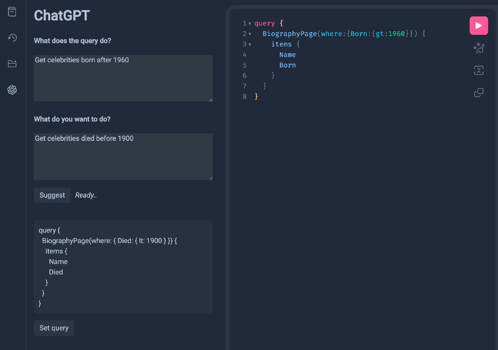

# GraphiQL ChatGPT plugin

[](https://www.npmjs.com/package/graphiql-plugin-chatgpt)

A GraphiQL plugin to get a generated query based on the current query via ChatGPT API.



## Install

Use your favorite package manager to install the package:

```sh
# yarn
yarn add graphiql-plugin-chatgpt

# npm
npm install --save graphiql-plugin-chatgpt
```

The following packages are peer dependencies, so make sure you have them installed as well:

```sh
#yarn
yarn add react react-dom graphql @graphiql/react

#npm
npm install --save react react-dom graphql @graphiql/react
```

## Usage

```ts
import { useChatGPTPlugin } from "graphiql-plugin-chatgpt"

import "graphiql-plugin-chatgpt/dist/graphiql-plugin-chatgpt.css"

function App() {
  // ...
  const chatGPTPlugin = useChatGPTPlugin({
    config: { provider: "openai", apiKey: getOpenAIApiKey() },
    userId: getUserId(),
    query: query,
    onEdit: setQuery,
  });
  
  return (
    <GraphiQL
      query={query}
      onEditQuery={setQuery}
      plugins={[chatGPTPlugin]}
    />
  );
}
```

## Props

| field  | required | type                  | description                                                             |
|--------|----------|-----------------------|-------------------------------------------------------------------------|
| config | true     | `OpenAIProviderConfig`  | API service config                                                      |
| query  | true     | `string`                | Current query                                                           |
| userId | true     | `string`                | User identifier (required to prevent side-effects from other users run) |
| onEdit | true     | `(query: string)=>void` | Query setter function (run on `Set query` button click)                 |

## Types

```ts
export type OpenAIProviderConfig = DefaultOpenAIProviderConfig | AzureOpenAIProviderConfig

// You can use your OpenAI api key
// https://platform.openai.com/account/api-keys
type DefaultOpenAIProviderConfig = {
  provider: "openai"
  apiKey: string
}

type AzureOpenAIProviderConfig = {
  provider: "azure"
  apiKey: string
  endpoint: string
  apiVersion: string
}
```

## Credits

This project was highly inspired from the @cx0's hackathon project (<https://github.com/cx0/chatGPT-for-genetics>)
